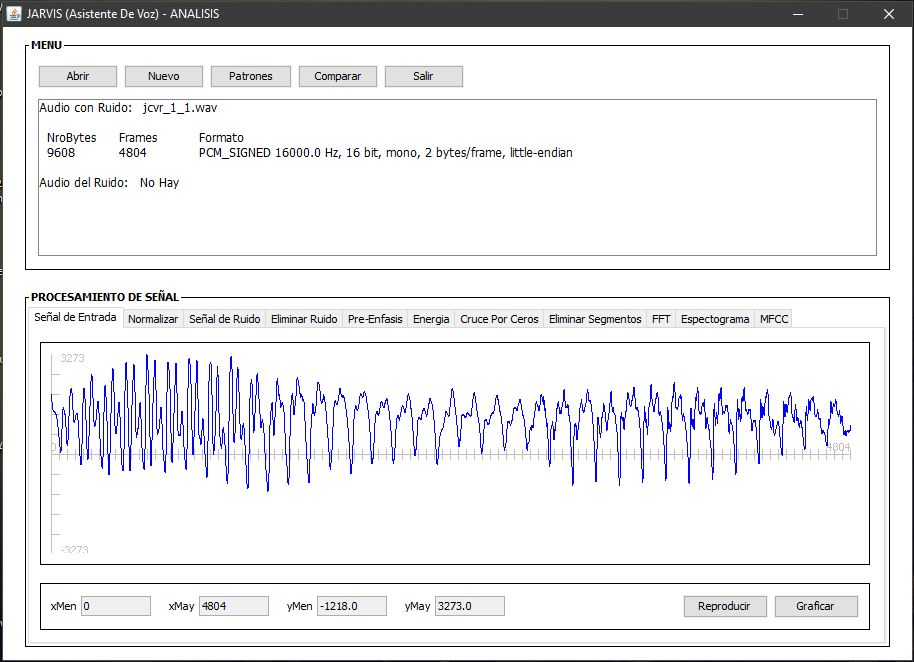
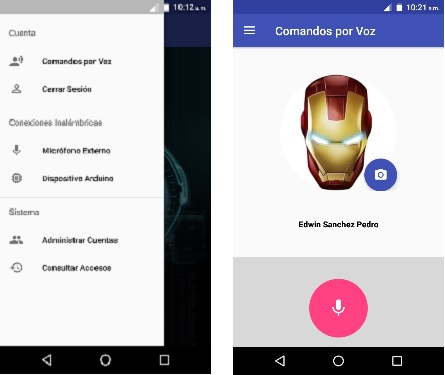

# Sistema de seguridad para el control de acceso a una vivienda mediante el reconocimiento de voz utilizando coeficientes cepstrum MFCC Y DTW

## Screenshots

### 1. Desktop Application

The desktop application was used to make the evaluation and testing of the voice recognition algorithm in the preprocessing, training and recognition of voice signals stages, in addition this application is also used to record the surrounding noise through the computer microphone , by request of the mobile application.

### 2. Mobile Application

The Android mobile application will allow the control of access to the home through the recognition of the voice of the announcer, in addition the system administrator can administer the data of the users of the system and see the history of access to the home.

